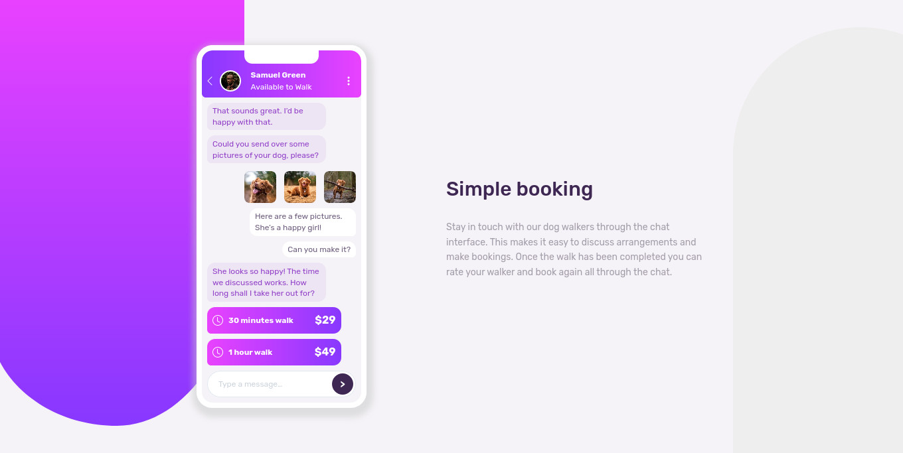

# Frontend Mentor - Chat app CSS illustration solution

This is a solution to the [Chat app CSS illustration challenge on Frontend Mentor](https://www.frontendmentor.io/challenges/chat-app-css-illustration-O5auMkFqY).

## Table of contents

- [Overview](#overview)
  - [The challenge](#the-challenge)
<!--   - [Screenshot](#screenshot)
  - [Links](#links) -->
- [My process](#my-process)
  - [Built with](#built-with)
- [Author](#author)

## Overview

### The challenge

Users should be able to:

- View the optimal layout for the site depending on their device's screen size
- See hover states for all interactive elements on the page

<!-- ### Screenshot

### Links

- Solution URL: [https://github.com/donosti1/fm-chat-app-css-illustration](https://github.com/donosti1/fm-chat-app-css-illustration)
- Live Site URL: [https://fm-chat-app-css-illustration-donosti1.vercel.app/](https://fm-chat-app-css-illustration-donosti1.vercel.app/)
 -->
## My process

### Built with

- [React](https://reactjs.org/) - JS library
- [Chakra UI](https://chakra-ui.com/) - React Component library

## Author

- Frontend Mentor - [@donosti1](https://www.frontendmentor.io/profile/donosti1)
- Github - [@donosti1](https://github.com/donosti1)